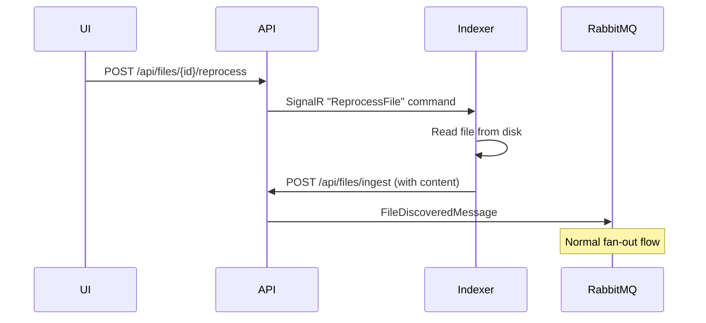

# Re-process Files Feature

**Status**: ✅ Complete
**PR**: [#TBD](https://github.com/gbolabs/photos-index/pull/TBD)
**Priority**: High
**Track**: API + Web UI

## Problem

Files that failed processing (e.g., HEIC before v0.3.9) remain in database with `width=null`, `thumbnailPath=null`. Currently no way to re-trigger processing without a full rescan.

## Requirements

1. **API endpoint** to trigger re-processing of specific files
2. **UI controls** to select and re-process files
3. **Bulk operations** for efficiency
4. **Filters** to find files needing re-processing

## Design Options

### Option A: API Publishes New FileDiscoveredMessage

API re-publishes `FileDiscoveredMessage` for selected files. Requires file content to be re-uploaded to MinIO.

```
UI → API (POST /api/files/reprocess)
       → Re-upload file to MinIO (needs source path)
       → Publish FileDiscoveredMessage
       → MetadataService + ThumbnailService process
```

**Problem**: API doesn't have access to original files (Indexer does).

### Option B: Command Message to Indexer

New message type `ReprocessFileCommand` sent to Indexer. Indexer re-reads file and sends to API.

```
UI → API (POST /api/files/reprocess)
       → Publish ReprocessFileCommand
       → Indexer receives, reads file, uploads to API
       → Normal flow continues
```

**Pros**: Indexer has file access, reuses existing flow
**Cons**: Requires Indexer to consume commands (currently publish-only)

### Option C: Direct MinIO Re-fetch by Services

Store original file permanently in MinIO. Services re-fetch on demand.

```
UI → API (POST /api/files/reprocess)
       → Re-publish FileDiscoveredMessage (file already in MinIO)
       → Services process from existing MinIO file
```

**Problem**: Conflicts with v0.3.8 cleanup (files deleted after processing).

### Option D: ~~Indexer Command Queue~~ (Rejected)

Would require Indexer to consume from RabbitMQ, breaking its simple API-client design.

### Option E: SignalR between API and Indexer (Recommended)

API maintains SignalR connection to Indexer(s). Commands flow over SignalR, keeping Indexer as HTTP+SignalR client only.

```
┌─────────┐  SignalR   ┌─────────┐  RabbitMQ  ┌──────────────┐
│ Indexer │◄──────────►│   API   │───────────►│ MetadataSvc  │
│         │   HTTP     │         │            │ ThumbnailSvc │
└─────────┘───────────►└─────────┘            └──────────────┘
```



**Benefits:**
- Indexer stays simple (no RabbitMQ consumption)
- API remains single communication partner
- Bidirectional: commands down, status up
- Can target specific Indexer by connection ID (multi-NAS support)

## API Endpoints

```
POST /api/files/{id}/reprocess
  - Re-process single file

POST /api/files/reprocess
  Body: { fileIds: [...] }
  - Bulk re-process

POST /api/files/reprocess/query
  Body: { filter: "missing-metadata" | "missing-thumbnail" | "failed" | "heic" }
  - Re-process by filter
```

## SignalR Hub

```csharp
// API Hub
public class IndexerHub : Hub
{
    // Called by API to request reprocess
    public async Task ReprocessFile(Guid fileId, string filePath)
    {
        // Send to specific Indexer or broadcast
        await Clients.All.SendAsync("ReprocessFile", fileId, filePath);
    }

    // Called by Indexer to report status
    public async Task ReportProgress(string status, int processed, int total)
    {
        // Forward to UI clients
        await Clients.Group("ui-clients").SendAsync("IndexerProgress", status, processed, total);
    }
}
```

## Indexer SignalR Client

```csharp
// Indexer connects to API hub
_hubConnection = new HubConnectionBuilder()
    .WithUrl($"{_apiBaseUrl}/hubs/indexer")
    .WithAutomaticReconnect()
    .Build();

_hubConnection.On<Guid, string>("ReprocessFile", async (fileId, filePath) =>
{
    if (!File.Exists(filePath))
    {
        _logger.LogWarning("File not found: {Path}", filePath);
        return;
    }

    await using var stream = File.OpenRead(filePath);
    await _apiClient.IngestFileWithContentAsync(fileId, stream, ...);
});

await _hubConnection.StartAsync();
```

## UI Components

### Files List Actions

- [ ] "Reprocess" button on individual file row
- [ ] Multi-select checkbox + "Reprocess Selected" bulk action
- [ ] Filter dropdown: "Show files missing metadata/thumbnail"

### Batch Operations Page

- [ ] "Reprocess all HEIC files" button
- [ ] "Reprocess failed files" button
- [ ] Progress indicator for bulk operations

## Database Considerations

### Track Processing Status

Add columns to `IndexedFiles`:
```sql
MetadataProcessedAt TIMESTAMP NULL
ThumbnailProcessedAt TIMESTAMP NULL
LastProcessingError TEXT NULL
ProcessingRetryCount INT DEFAULT 0
```

### Query Filters

```sql
-- Files missing metadata
SELECT * FROM IndexedFiles WHERE Width IS NULL

-- Files missing thumbnail
SELECT * FROM IndexedFiles WHERE ThumbnailPath IS NULL

-- HEIC files (for targeted reprocess)
SELECT * FROM IndexedFiles WHERE FileName ILIKE '%.heic'

-- Failed files
SELECT * FROM IndexedFiles WHERE LastProcessingError IS NOT NULL
```

## Implementation Phases

### Phase 1: SignalR Hub in API
- [ ] Add `IndexerHub` SignalR hub
- [ ] Configure SignalR in API startup
- [ ] API endpoint `POST /api/files/{id}/reprocess`

### Phase 2: Indexer SignalR Client
- [ ] Add SignalR client to Indexer
- [ ] Connect to API hub on startup
- [ ] Handle `ReprocessFile` command
- [ ] Re-read file and POST to API

### Phase 3: Bulk Operations
- [ ] Bulk endpoint `POST /api/files/reprocess`
- [ ] Query-based endpoint with filters
- [ ] Rate limiting to avoid overwhelming system

### Phase 4: UI
- [ ] Individual reprocess button
- [ ] Bulk selection
- [ ] Filter views
- [ ] Progress feedback

## Acceptance Criteria

- [ ] Single file can be re-processed via API
- [ ] Bulk re-process works for 1000+ files
- [ ] UI shows reprocess option on file details
- [ ] Filter for "missing metadata" shows correct files
- [ ] HEIC files process correctly after v0.3.9 + reprocess

## Notes

- Consider rate limiting to prevent Indexer overload
- May need progress tracking for large bulk operations
- Could add WebSocket/SignalR for real-time progress updates
