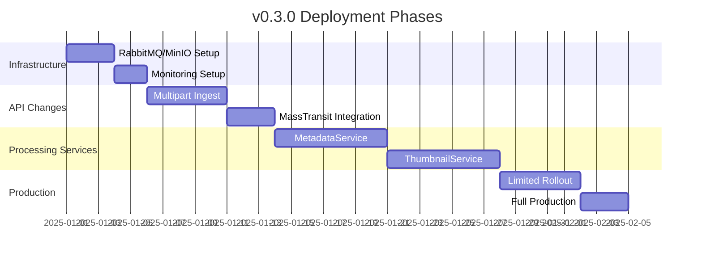

# v0.3.0 Release Plan - Improvements & Enhancements

This document supplements the main v0.3.0 release plan with additional recommendations for production readiness, security, monitoring, and operational excellence.

## Table of Contents

1. [Error Handling & Resilience](#error-handling--resilience)
2. [Monitoring & Alerting](#monitoring--alerting)
3. [Security Enhancements](#security-enhancements)
4. [Deployment Strategy](#deployment-strategy)
5. [Performance Optimization](#performance-optimization)
6. [Testing Strategy](#testing-strategy)
7. [Documentation Improvements](#documentation-improvements)
8. [Cost Optimization](#cost-optimization)

## Error Handling & Resilience

### Retry Policy

Enhance the current error handling with a comprehensive retry strategy:

```markdown
- **Transient errors**: 3 retries with exponential backoff (1s, 3s, 10s)
- **Permanent errors**: Move to dead letter queue after 3 attempts
- **Message TTL**: 24 hours for processing messages
- **Circuit breakers**: MassTransit circuit breaker for MinIO/RabbitMQ connectivity
```

### Dead Letter Queue (DLQ)

```yaml
# RabbitMQ configuration for DLQ
rabbitmq:
  queues:
    metadata-processing:
      dead-letter-exchange: dlx
      dead-letter-routing-key: metadata.dlx
    thumbnail-processing:
      dead-letter-exchange: dlx
      dead-letter-routing-key: thumbnail.dlx
```

### Health Checks

```csharp
// Add to Program.cs for each service
builder.Services.AddHealthChecks()
    .AddRabbitMQ(rabbitmqConnectionString, name: "rabbitmq")
    .AddMinio(minioOptions, name: "minio")
    .AddProcessAllocatedMemoryHealthCheck(maxMegabytes: 2048, name: "memory")
    .AddDiskStorageHealthCheck(d => d.AddDrive("C:", 1024), name: "disk");
```

## Monitoring & Alerting

### Critical Alerts

```markdown
- **Queue depth > 100 messages** for >5 minutes → PagerDuty alert
- **Processing failure rate > 5%** over 15 minutes → Slack notification
- **Message processing time > 5s** average → Warning alert
- **MinIO/RabbitMQ connectivity lost** → Critical alert
```

### Dashboard Metrics

```json
{
  "metrics": {
    "processing_rate": {
      "type": "counter",
      "description": "Messages processed per second"
    },
    "queue_depth": {
      "type": "gauge",
      "description": "Current pending messages"
    },
    "error_rate": {
      "type": "gauge",
      "description": "Failed vs successful processing ratio"
    },
    "processing_latency": {
      "type": "histogram",
      "description": "End-to-end processing time in milliseconds"
    }
  }
}
```

### Logging Strategy

```csharp
// Configure OpenTelemetry logging
builder.Services.AddOpenTelemetry()
    .WithTracing(tracing => tracing
        .AddSource("MassTransit")
        .AddSource("Minio")
        .AddAspNetCoreInstrumentation()
        .AddHttpClientInstrumentation()
        .AddOtlpExporter())
    .WithMetrics(metrics => metrics
        .AddMeter("PhotosIndex*")
        .AddAspNetCoreInstrumentation()
        .AddRuntimeInstrumentation()
        .AddOtlpExporter());
```

## Security Enhancements

### MinIO Security

```markdown
**Phase 1**: Public read bucket (current implementation)
**Phase 2**: Presigned URLs with 15-minute expiry
**Phase 3**: IAM policy for thumbnail access
```

```csharp
// Presigned URL generation
public async Task<string> GeneratePresignedThumbnailUrl(string objectName, int expiryMinutes = 15)
{
    var args = new PresignedGetObjectArgs()
        .WithBucket("thumbnails")
        .WithObject(objectName)
        .WithExpiry(expiryMinutes * 60);
    
    return await _minioClient.PresignedGetObjectAsync(args);
}
```

### RabbitMQ Security

```yaml
# Enhanced RabbitMQ configuration
rabbitmq:
  environment:
    RABBITMQ_DEFAULT_USER: photos
    RABBITMQ_DEFAULT_PASS: ${RABBITMQ_PASSWORD}
    RABBITMQ_SSL_CERTFILE: /etc/rabbitmq/certs/server_certificate.pem
    RABBITMQ_SSL_KEYFILE: /etc/rabbitmq/certs/server_key.pem
    RABBITMQ_SSL_CACERTFILE: /etc/rabbitmq/certs/ca_certificate.pem
  
vhosts:
  photos-index:
    permissions:
      - user: photos
        configure: ".*"
        write: ".*"
        read: ".*"
```

### Network Security

```yaml
# Traefik middleware for security headers
traefik:
  http:
    middlewares:
      security-headers:
        headers:
          sslRedirect: true
          stsSeconds: 31536000
          stsIncludeSubdomains: true
          stsPreload: true
          forceSTSHeader: true
          frameDeny: true
          contentTypeNosniff: true
          browserXssFilter: true
```

## Deployment Strategy

### Phased Rollout



### Feature Flags

```env
# Enable/disable distributed processing
DISTRIBUTED_PROCESSING_ENABLED=true
FALLBACK_TO_LOCAL=false
MAX_PARALLELISM_OVERRIDE=4
```

```csharp
// Feature flag implementation
public class ProcessingOptions
{
    public bool DistributedProcessingEnabled { get; set; } = true;
    public bool FallbackToLocal { get; set; } = false;
    public int MaxParallelism { get; set; } = 4;
}

// Usage in service
if (_options.DistributedProcessingEnabled)
{
    // Use RabbitMQ/MinIO
}
else
{
    // Fallback to local processing
}
```

### Rollback Plan

```markdown
1. **Toggle feature flag**: `DISTRIBUTED_PROCESSING_ENABLED=false`
2. **Scale down services**: `docker-compose scale metadata=0 thumbnail=0`
3. **Revert API changes**: Git revert with database migration
4. **Monitor system**: Verify local processing works
5. **Communicate**: Notify users of temporary degradation
```

## Performance Optimization

### Parallelism Configuration

```env
# MetadataService configuration
METADATA_MAX_PARALLELISM=4
METADATA_BATCH_SIZE=10
METADATA_TIMEOUT_SECONDS=30

# ThumbnailService configuration
THUMBNAIL_MAX_PARALLELISM=8
THUMBNAIL_BATCH_SIZE=20
THUMBNAIL_TIMEOUT_SECONDS=60
THUMBNAIL_QUALITY=80
```

### Resource Limits

```yaml
# docker-compose resource limits
deploy:
  resources:
    limits:
      cpus: '2.0'
      memory: 2G
    reservations:
      cpus: '0.5'
      memory: 512M
```

### Caching Strategy

```csharp
// MinIO client caching
services.AddSingleton<IMinioClient>(sp =>
{
    var options = sp.GetRequiredService<MinioOptions>();
    return new MinioClient()
        .WithEndpoint(options.Endpoint)
        .WithCredentials(options.AccessKey, options.SecretKey)
        .WithHttpClient(new HttpClient(new CachingHttpClientHandler())
        {
            Timeout = TimeSpan.FromSeconds(30)
        })
        .Build();
});
```

### Thumbnail Optimization

```csharp
// Optimized thumbnail generation
public async Task<Stream> GenerateThumbnail(Stream imageStream, int maxWidth, int maxHeight, int quality)
{
    using var image = await Image.LoadAsync(imageStream);
    
    // Calculate aspect ratio
    var ratio = Math.Min(maxWidth / (float)image.Width, maxHeight / (float)image.Height);
    var width = (int)(image.Width * ratio);
    var height = (int)(image.Height * ratio);
    
    // Resize with high quality
    image.Mutate(x => x.Resize(width, height, KnownResamplers.Lanczos3));
    
    // Optimize JPEG encoding
    var encoder = new JpegEncoder()
    {
        Quality = quality,
        Subsample = JpegSubsample.Ratio420
    };
    
    var result = new MemoryStream();
    await image.SaveAsJpegAsync(result, encoder);
    result.Position = 0;
    
    return result;
}
```

## Testing Strategy

### Test Coverage Targets

| Component | Unit Tests | Integration Tests | E2E Tests | Total |
|-----------|------------|-------------------|-----------|-------|
| API Gateway | 90% | 80% | Included | 100% |
| MetadataService | 85% | 75% | Included | 95% |
| ThumbnailService | 85% | 75% | Included | 95% |
| Message Contracts | 95% | - | - | 95% |
| Shared Libraries | 90% | 80% | - | 95% |

### Test Scenarios

```markdown
**Unit Tests:**
- Message contract serialization/deserialization
- Service logic in isolation
- Error handling scenarios

**Integration Tests:**
- Message flow through RabbitMQ
- MinIO upload/download
- Database updates
- End-to-end message processing

**E2E Tests:**
- Full workflow from file ingest to thumbnail display
- Error recovery scenarios
- High load testing
- Network partition testing
```

### Test Data Strategy

```csharp
// Test data builder pattern
public class TestFileBuilder
{
    private string _path = "/test/photo.jpg";
    private long _size = 1024;
    private string _hash = "abc123";
    
    public TestFileBuilder WithPath(string path)
    {
        _path = path;
        return this;
    }
    
    public TestFileBuilder WithSize(long size)
    {
        _size = size;
        return this;
    }
    
    public IndexedFile Build()
    {
        return new IndexedFile
        {
            FilePath = _path,
            FileSize = _size,
            FileHash = _hash,
            // ... other properties
        };
    }
}
```

## Documentation Improvements

### Admin Guide

```markdown
## Monitoring Setup

### Accessing Dashboards
- **RabbitMQ Management**: http://localhost:15672
  - Username: photos
  - Password: [from config]

- **MinIO Console**: http://localhost:9001
  - Username: minioadmin
  - Password: [from config]

- **Aspire Dashboard**: http://localhost:18888
  - No authentication required (internal only)

### Common Issues

**Queue Depth High:**
1. Check service logs for errors
2. Verify MinIO connectivity
3. Restart processing services
4. Monitor for improvement

**Processing Failures:**
1. Check DLQ for failed messages
2. Examine error details
3. Fix underlying issue
4. Requeue messages via API
```

### Developer Guide

```markdown
## Adding New Processing Services

### Step 1: Create Message Contract
```csharp
// src/Shared/Messages/NewProcessingMessage.cs
public record NewProcessingMessage
{
    public Guid CorrelationId { get; init; }
    public Guid IndexedFileId { get; init; }
    // Add service-specific properties
}
```

### Step 2: Create Consumer
```csharp
// src/NewService/Consumers/FileDiscoveredConsumer.cs
public class FileDiscoveredConsumer : IConsumer<FileDiscoveredMessage>
{
    public async Task Consume(ConsumeContext<FileDiscoveredMessage> context)
    {
        // Process file
        // Publish result
    }
}
```

### Step 3: Register Consumer
```csharp
// Program.cs
builder.Services.AddMassTransit(x =>
{
    x.AddConsumer<FileDiscoveredConsumer>();
    x.UsingRabbitMq((context, cfg) =>
    {
        cfg.ReceiveEndpoint("new-service-queue", e =>
        {
            e.ConfigureConsumer<FileDiscoveredConsumer>(context);
        });
    });
});
```

### Step 4: Add Docker Container
```yaml
# docker-compose.yml
new-service:
  build: src/NewService
  environment:
    - MESSAGE_BUS_CONNECTION=amqp://rabbitmq:5672
    - MINIO_ENDPOINT=minio:9000
  depends_on:
    - rabbitmq
    - minio
```
```

### Migration Guide

```markdown
## Upgrading from v0.2.x to v0.3.0

### Prerequisites
- Docker 20.10+
- Docker Compose 2.0+
- .NET 10 SDK
- 4GB RAM minimum

### Step 1: Backup
```bash
# Backup database
docker exec photos-index-postgres pg_dump -U postgres photos > backup.sql

# Backup configuration
cp .env .env.backup
cp deploy/docker/.env deploy/docker/.env.backup
```

### Step 2: Update Configuration
```bash
# Add new environment variables to .env
cat >> .env << 'EOF'
# RabbitMQ
RABBITMQ_HOST=rabbitmq
RABBITMQ_USER=photos
RABBITMQ_PASSWORD=photos

# MinIO
MINIO_ENDPOINT=minio:9000
MINIO_ACCESS_KEY=minioadmin
MINIO_SECRET_KEY=minioadmin
EOF
```

### Step 3: Update Docker Compose
```bash
# Pull new images
docker-compose pull

# Recreate containers
docker-compose up -d --build
```

### Step 4: Verify
```bash
# Check service health
docker-compose ps

# Check logs
docker-compose logs -f api

# Run health checks
curl http://localhost:5000/health
```
```

## Cost Optimization

### Resource Efficiency

```yaml
# Auto-scaling configuration (Kubernetes)
resources:
  requests:
    cpu: "500m"
    memory: "512Mi"
  limits:
    cpu: "2000m"
    memory: "2Gi"

autoscaling:
  minReplicas: 1
  maxReplicas: 4
  targetCPUUtilizationPercentage: 70
  targetMemoryUtilizationPercentage: 80
```

### Storage Optimization

```yaml
# MinIO lifecycle policy
lifecycle:
  rule:
    id: temp-images-cleanup
    status: enabled
    filter:
      prefix: temp-images/
    expiration:
      days: 1
    transition:
      days: 0
      storage_class: STANDARD
```

### Cost Monitoring

```markdown
**Metrics to Monitor:**
- CPU utilization per service
- Memory usage per service
- Storage growth rate
- Network bandwidth usage

**Alert Thresholds:**
- CPU > 80% for >15 minutes
- Memory > 90% for >10 minutes
- Storage growth > 1GB/day
```

## Implementation Recommendations

### Priority Order

1. **Infrastructure First** - RabbitMQ, MinIO with monitoring
2. **API Gateway** - With feature flags and fallback
3. **MetadataService** - Simpler service, good starting point
4. **ThumbnailService** - More complex image processing
5. **Gradual Rollout** - Start conservative, monitor, then scale

### Risk Mitigation

- **Feature flags** for all new functionality
- **Local fallback** for critical operations
- **Comprehensive monitoring** before production
- **Gradual parallelism increase** (start with 2 workers, then scale)
- **DLQ monitoring** for error detection

### Success Metrics

- **Synology CPU usage** < 30% average
- **Processing rate** > 10 items/second
- **Error rate** < 1%
- **Queue depth** < 50 messages
- **End-to-end latency** < 2 seconds

## Conclusion

These improvements enhance the v0.3.0 release plan by adding:
- **Production readiness** with better error handling and monitoring
- **Security hardening** with proper authentication and network isolation
- **Operational excellence** with deployment strategies and rollback plans
- **Performance optimization** with tuning and resource management
- **Comprehensive testing** for reliability
- **Cost awareness** for efficient resource usage

The core architecture remains excellent - these enhancements focus on making it production-grade and operationally robust.

## Home/Personal Use Considerations

For personal/home use, consider a simplified approach:

### Recommended for Home Use

**✅ Keep:**
- Core distributed processing architecture
- Simple error handling (basic retries)
- Basic monitoring (Aspire dashboard)
- MinIO public bucket for thumbnails
- Simple deployment (docker-compose)

**❌ Skip (Overkill for Home):**
- Complex monitoring (Prometheus/Grafana)
- Advanced security (TLS, IAM policies)
- Canary deployments
- Feature flags
- Exhaustive test coverage (>80%)
- Detailed documentation

### Simplified Home Deployment

```yaml
# Minimal docker-compose for home use
version: '3.8'

services:
  rabbitmq:
    image: rabbitmq:management
    ports: ["5672:5672", "15672:15672"]
    environment:
      RABBITMQ_DEFAULT_USER: photos
      RABBITMQ_DEFAULT_PASS: photos

  minio:
    image: minio/minio
    command: server /data --console-address ":9001"
    ports: ["9000:9000", "9001:9001"]
    environment:
      MINIO_ROOT_USER: minioadmin
      MINIO_ROOT_PASSWORD: minioadmin
```

### Home Use Philosophy

For personal projects:
- **KISS Principle**: Keep It Simple, Stupid
- **YAGNI Principle**: You Aren't Gonna Need It
- **Functional > Perfect**: Working solution over perfect architecture
- **Maintainable > Scalable**: Easy to maintain over enterprise-scale

The goal is a system that works well at home, not an enterprise platform!
